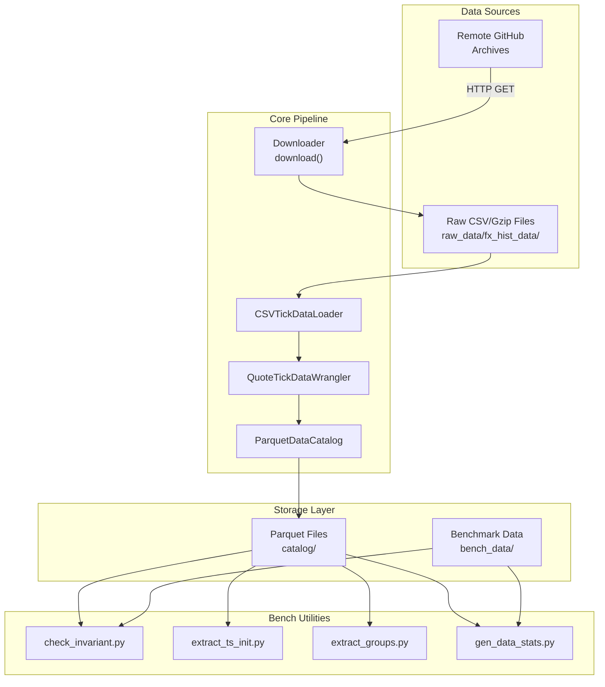
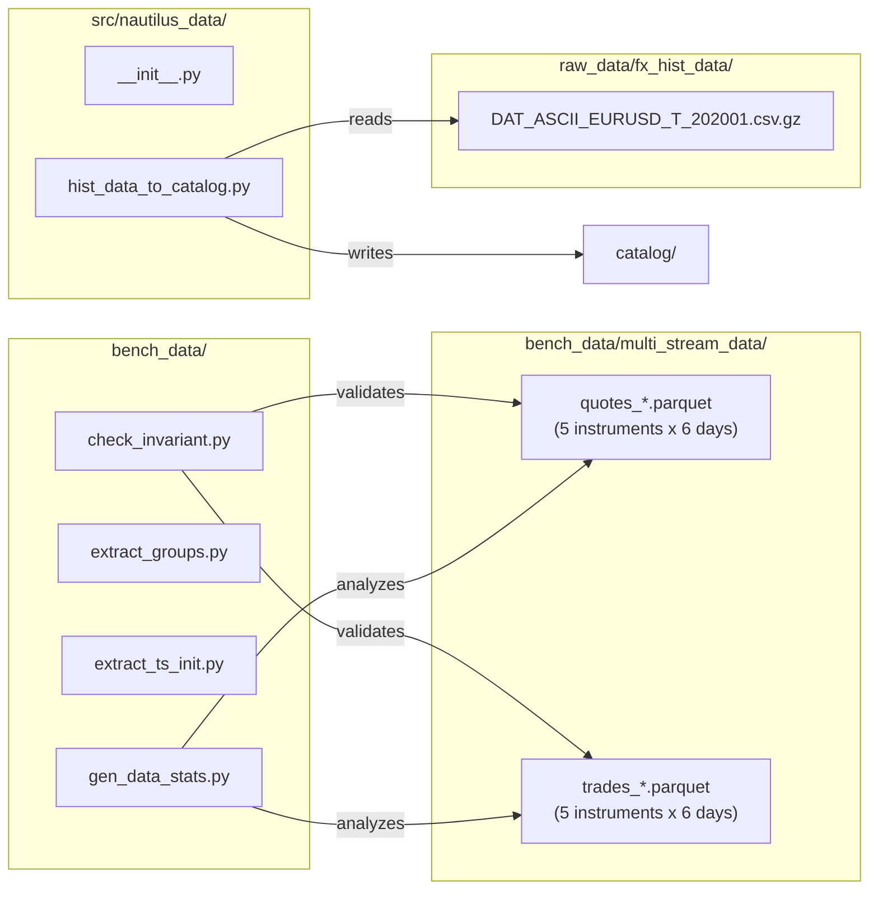
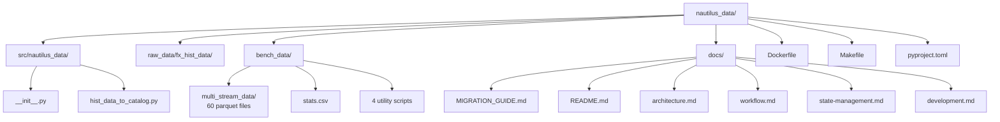

# Nautilus Data Documentation

> **Last Updated**: 2026-04-06T17:20:03Z  \
> **Git Hash**: `4103348`

**Version**: 0.18.0
**License**: LGPL-3.0
**Python**: 3.13+
**Dependency**: NautilusTrader >= 1.220.0

## Overview

`nautilus_data` is a market data library that provides example historical tick data for use with [NautilusTrader](https://nautechsystems.io). It handles the full lifecycle of market data: downloading raw CSV/gzip files from remote sources, wrangling them into NautilusTrader-compatible data types (quote ticks, trade ticks), and writing them into a Parquet-based data catalog for backtesting and analysis.

The library also ships benchmark datasets and utilities for validating data integrity, extracting row group metadata, and generating statistics across Parquet file collections.

## Features

### Data Ingestion
- Download raw FX tick data from GitHub-hosted CSV archives
- Parse CSV data with configurable datetime formats and column mappings
- Support for gzip-compressed source files

### Data Transformation
- Wrangle raw bid/ask/size data into NautilusTrader `QuoteTick` objects via `QuoteTickDataWrangler`
- Instrument resolution through `TestInstrumentProvider` for FX currency pairs
- Schema-aware conversion with proper precision metadata

### Data Storage
- Parquet-based catalog via `ParquetDataCatalog` for columnar storage
- Configurable row group sizes for performance tuning
- Snappy compression for efficient disk usage
- Multi-stream data support (multiple instruments, multiple dates)

### Benchmarking and Validation
- Timestamp invariant checking (monotonic ordering of `ts_init`)
- Row group boundary extraction for catalog inspection
- File-level statistics generation (size, row counts, max row group size)
- Multi-instrument benchmark datasets (5 instruments x 6 trading days)

## Architecture Overview



## Component Overview



## Data Formats

### Quote Tick Schema (PyArrow)

| Column      | Type     | Description                        |
|-------------|----------|------------------------------------|
| `bid`       | `int64`  | Bid price (fixed-point integer)    |
| `ask`       | `int64`  | Ask price (fixed-point integer)    |
| `bid_size`  | `uint64` | Bid size                           |
| `ask_size`  | `uint64` | Ask size                           |
| `ts_event`  | `uint64` | Event timestamp (nanoseconds)      |
| `ts_init`   | `uint64` | Initialization timestamp (nanos)   |

### Trade Tick Schema (PyArrow)

| Column          | Type     | Description                     |
|-----------------|----------|---------------------------------|
| `price`         | `int64`  | Trade price (fixed-point)       |
| `size`          | `uint64` | Trade size                      |
| `aggresor_side` | `uint8`  | Aggressor side enum             |
| `trade_id`      | `string` | Unique trade identifier         |
| `ts_event`      | `uint64` | Event timestamp (nanoseconds)   |
| `ts_init`       | `uint64` | Initialization timestamp        |

### Schema Metadata

Both schemas carry instrument-level metadata:
- `instrument_id`: e.g., `EUR/USD.SIM`
- `price_precision`: decimal precision for prices
- `size_precision`: decimal precision for sizes

## Project Structure



## Quick Start

This example creates a `ParquetDataCatalog` from inline tick data without downloading anything. It requires `nautilus_trader >= 1.220.0` and `pandas`.

```python
from pathlib import Path
import pandas as pd

from nautilus_trader.persistence.catalog import ParquetDataCatalog
from nautilus_trader.persistence.wranglers import QuoteTickDataWrangler
from nautilus_trader.test_kit.providers import TestInstrumentProvider

# 1. Create a temporary catalog directory
catalog_path = Path("my_catalog")
catalog_path.mkdir(exist_ok=True)

# 2. Resolve the EUR/USD instrument (ships with NautilusTrader test kit)
instrument = TestInstrumentProvider.default_fx_ccy("EUR/USD")

# 3. Build a small DataFrame of quote ticks
data = {
    "bid_price": [1.10010, 1.10015, 1.10012, 1.10020, 1.10018],
    "ask_price": [1.10020, 1.10025, 1.10022, 1.10030, 1.10028],
    "size":      [1000000, 1500000, 1200000, 1800000, 1100000],
}
df = pd.DataFrame(data, index=pd.date_range("2024-01-02 09:30", periods=5, freq="s"))

# 4. Wrangle into NautilusTrader QuoteTick objects
wrangler = QuoteTickDataWrangler(instrument)
ticks = wrangler.process(df)
print(f"Created {len(ticks)} quote ticks for {instrument.id}")

# 5. Write to Parquet catalog
catalog = ParquetDataCatalog(str(catalog_path))
catalog.write_data([instrument])
catalog.write_data(ticks)

# 6. Read back and verify
loaded = catalog.quote_ticks(instrument_ids=[str(instrument.id)])
print(f"Read back {len(loaded)} ticks from catalog")
print(f"First tick: bid={loaded[0].bid_price}, ask={loaded[0].ask_price}")
```

## Documentation Index

| Document | Description |
|----------|-------------|
| [Architecture](architecture.md) | System design, components, data providers, storage backends |
| [Workflow](workflow.md) | Data ingestion, query, and transformation flows |
| [State Management](state-management.md) | Catalog state, caching, data integrity |
| [Development](development.md) | Development standards, patterns, extending the library |
| [Migration Guide](MIGRATION_GUIDE.md) | Upstream sync and modernization notes |

## Links

- [NautilusTrader](https://nautechsystems.io) - Parent trading platform
- [NautilusTrader GitHub](https://github.com/nautechsystems/nautilus_trader) - Core framework
- [PyPI Package Index](https://packages.nautechsystems.io/simple) - Nautech package registry
- [LGPL-3.0 License](https://www.gnu.org/licenses/lgpl-3.0.en.html)

## Build and Test

```bash
make install        # Install dependencies
make pytest         # Run tests
make ruff           # Lint with auto-fix
make format         # Format code
make mypy           # Type checking
make docker-build   # Build Docker image
```
