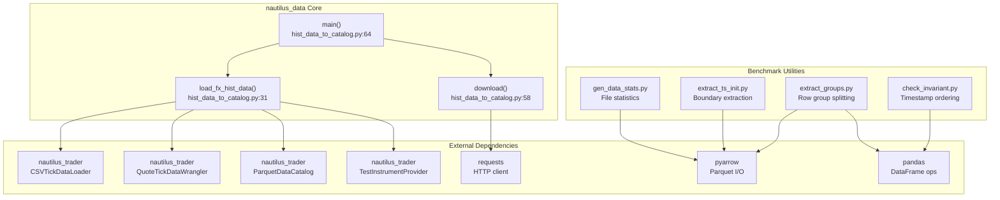
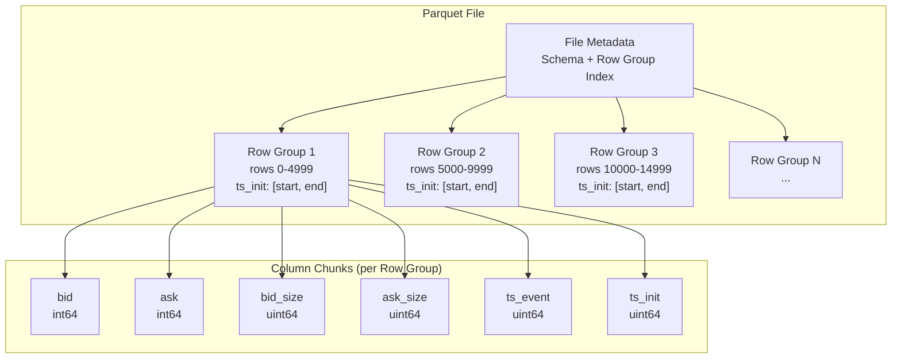
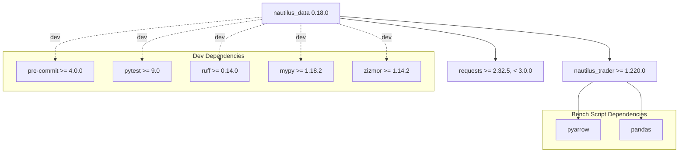

# Architecture

## System Design

`nautilus_data` follows a pipeline architecture for transforming raw market data into NautilusTrader-compatible Parquet catalogs. The system is deliberately simple: a thin Python layer orchestrating NautilusTrader's data infrastructure (loaders, wranglers, catalogs) with utility scripts for validation and benchmarking.

The design separates concerns into three layers:

1. **Ingestion Layer** - Downloading and parsing raw data files
2. **Transformation Layer** - Converting raw data into typed tick objects
3. **Storage Layer** - Writing typed data into Parquet catalogs with proper schemas

## Trading Paradigm & Key Features

| Feature | Support | Details |
|---------|---------|---------|
| Backtesting Approach | N/A | Data library only; provides Parquet catalogs consumed by NautilusTrader's backtesting engine |
| Live Trading | No | Data preparation tool, not a trading system |
| Paper Trading | No | Not applicable |
| Multi-Asset | Yes | FX tick data (EUR/USD default); extensible to any asset class via custom loaders |
| Data Feeds | GitHub raw CSV, local files | Downloads compressed CSV and converts to Parquet catalogs |
| ML Integration | No | Pure data pipeline; no ML components |
| Risk Management | None | Not applicable |
| Optimization | No | Not applicable |
| Execution | N/A | No execution capability; feeds data to NautilusTrader |

## High-Level Architecture



## Component Details

### Core Module: `hist_data_to_catalog.py`

**Location**: `src/nautilus_data/hist_data_to_catalog.py`

This is the primary module containing all data pipeline logic. It exposes three functions:

#### `download(url: str) -> None`
Simple HTTP downloader that fetches a file from a URL and writes it to the current working directory. Uses `requests.get()` without streaming, suitable for moderately sized data files.

#### `load_fx_hist_data(filename, currency, catalog_path) -> None`
The main transformation function that:
1. Resolves the instrument via `TestInstrumentProvider.default_fx_ccy()`
2. Creates a `QuoteTickDataWrangler` bound to that instrument
3. Loads CSV data with `CSVTickDataLoader.load()` using datetime format `%Y%m%d %H%M%S%f`
4. Renames columns to `["bid_price", "ask_price", "size"]`
5. Processes the DataFrame into a list of `QuoteTick` objects
6. Writes both the instrument definition and tick data to a `ParquetDataCatalog`

#### `main() -> None`
Entry point that downloads EUR/USD January 2020 tick data from GitHub and loads it into the default catalog at `src/catalog/`.

### Constants

```python
ROOT = Path(__file__).parent.parent       # src/ directory
CATALOG_DIR = ROOT / "catalog"            # Default catalog output
CATALOG_DIR.mkdir(exist_ok=True)          # Auto-creates on import
```

## Data Provider Architecture

```mermaid
graph LR
    subgraph Providers["Data Providers"]
        GH["GitHub Raw<br/>CSV/Gzip archives"]
        LOCAL["Local Files<br/>raw_data/fx_hist_data/"]
    end

    subgraph Loaders["NautilusTrader Loaders"]
        CSV_LOADER["CSVTickDataLoader<br/>Index parsing<br/>Datetime format<br/>Column mapping"]
    end

    subgraph Wranglers["NautilusTrader Wranglers"]
        QT_WRANGLER["QuoteTickDataWrangler<br/>Instrument-bound<br/>Precision-aware<br/>Timestamp generation"]
    end

    subgraph Instruments["Instrument Resolution"]
        TEST_PROV["TestInstrumentProvider<br/>default_fx_ccy()"]
    end

    GH -->|download()| LOCAL
    LOCAL --> CSV_LOADER
    CSV_LOADER -->|DataFrame| QT_WRANGLER
    TEST_PROV -->|Instrument| QT_WRANGLER
    QT_WRANGLER -->|List[QuoteTick]| OUTPUT["Typed Tick Data"]
```

The provider model is extensible. To add a new data source, you implement:
1. A download/fetch function for the raw data
2. A loader step (reuse `CSVTickDataLoader` or write a custom one)
3. A wrangler step (NautilusTrader provides wranglers for quotes, trades, bars, etc.)

## Storage Backend: Parquet Catalog

The storage layer is built on NautilusTrader's `ParquetDataCatalog`, which wraps Apache Arrow / PyArrow for columnar storage.

### Catalog Structure

A catalog directory contains:
- **Instrument definitions** - Serialized instrument metadata
- **Tick data files** - Parquet files partitioned by data type and instrument
- **Row groups** - Data is organized into row groups for efficient partial reads

### Schema Design

Schemas are defined using PyArrow with instrument metadata attached at the schema level:

```python
# From bench_data/extract_groups.py
quote_tick_schema = pa.schema([
    ("bid", pa.int64()),
    ("ask", pa.int64()),
    ("bid_size", pa.uint64()),
    ("ask_size", pa.uint64()),
    ("ts_event", pa.uint64()),
    ("ts_init", pa.uint64()),
]).with_metadata({
    "instrument_id": "EUR/USD.SIM",
    "price_precision": "0",
    "size_precision": "0",
})
```

Key design decisions:
- **Fixed-point integers** for prices (`int64`) instead of floating-point, avoiding IEEE 754 rounding issues
- **Nanosecond timestamps** (`uint64`) for both event time and init time, supporting sub-microsecond precision
- **Schema-level metadata** for instrument identification and precision recovery

### Row Group Strategy

Row groups control the granularity of partial reads. The benchmark data uses a row group size of 5,000 rows (see `bench_data/stats.csv`), balancing between:
- **Small row groups**: Better for time-range queries (skip irrelevant groups via metadata)
- **Large row groups**: Better for full-scan throughput (fewer I/O operations)



## Benchmark Data Architecture

The `bench_data/` directory serves as a test harness for NautilusTrader's data loading performance.

### Multi-Stream Dataset

Located in `bench_data/multi_stream_data/`, the dataset contains:
- **5 instruments**: Identified by numeric IDs (0005, 9626, 9868, 9961, 9999)
- **6 trading days**: November 1-4, 8-9, 2022
- **2 data types**: Quotes and trades
- **60 files total**: 5 instruments x 6 days x 2 types

This simulates a realistic multi-instrument backtesting scenario where the engine must merge and replay data from multiple streams in timestamp order.

### Utility Scripts

| Script | Purpose | Input | Output |
|--------|---------|-------|--------|
| `check_invariant.py` | Validates `start_ts` monotonic ordering and `end_ts < next start_ts` | CSV stats file | Console warnings |
| `extract_groups.py` | Re-writes Parquet with custom row group sizes | Parquet file | New Parquet file |
| `extract_ts_init.py` | Extracts `ts_init` boundaries per row group | Parquet file | CSV with `[index, start_ts, end_ts, group_size]` |
| `gen_data_stats.py` | Generates file-level statistics for a folder of Parquet files | Directory | CSV with `[file_name, file_size_kb, total_rows, max_row_group_size]` |

## Docker Architecture

The `Dockerfile` implements a multi-stage build:

1. **Base stage**: Python 3.13-slim with environment variables
2. **Builder stage**: Installs system deps (clang, gcc, git, libssl), uv, and the project
3. **Application stage**: Copies only the Python site-packages and source code, then generates the data catalog at build time

The catalog is generated during the Docker build (`RUN python -m nautilus_data.hist_data_to_catalog`), so the resulting image contains pre-built Parquet data ready for backtesting.

## Dependency Graph



Note: `pyarrow` and `pandas` are transitive dependencies via `nautilus_trader`, not direct dependencies of `nautilus_data`.

## Design Decisions

### Why Parquet over HDF5 or Feather?
- **Columnar storage** aligns with time-series query patterns (read specific columns)
- **Row group metadata** enables time-range predicate pushdown without full scans
- **Compression** (Snappy) provides good throughput-to-size ratio
- **Ecosystem**: Arrow/Parquet is the standard for NautilusTrader catalogs

### Why Fixed-Point Integers for Prices?
- Avoids IEEE 754 floating-point rounding errors in financial calculations
- Integer arithmetic is faster and deterministic
- Precision is recoverable from schema metadata

### Why Nanosecond Timestamps?
- Sub-microsecond precision required for high-frequency tick data
- `uint64` nanoseconds provides ~584 years of range from epoch
- Matches NautilusTrader's internal timestamp representation

---
## See Also
- [README](README.md) — Project overview and quick start
- [Workflow](workflow.md) — Event flows and processing pipelines
- [State Management](state-management.md) — State lifecycle and data models
- [Development](development.md) — Development guide and best practices
