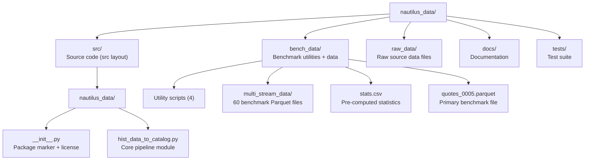
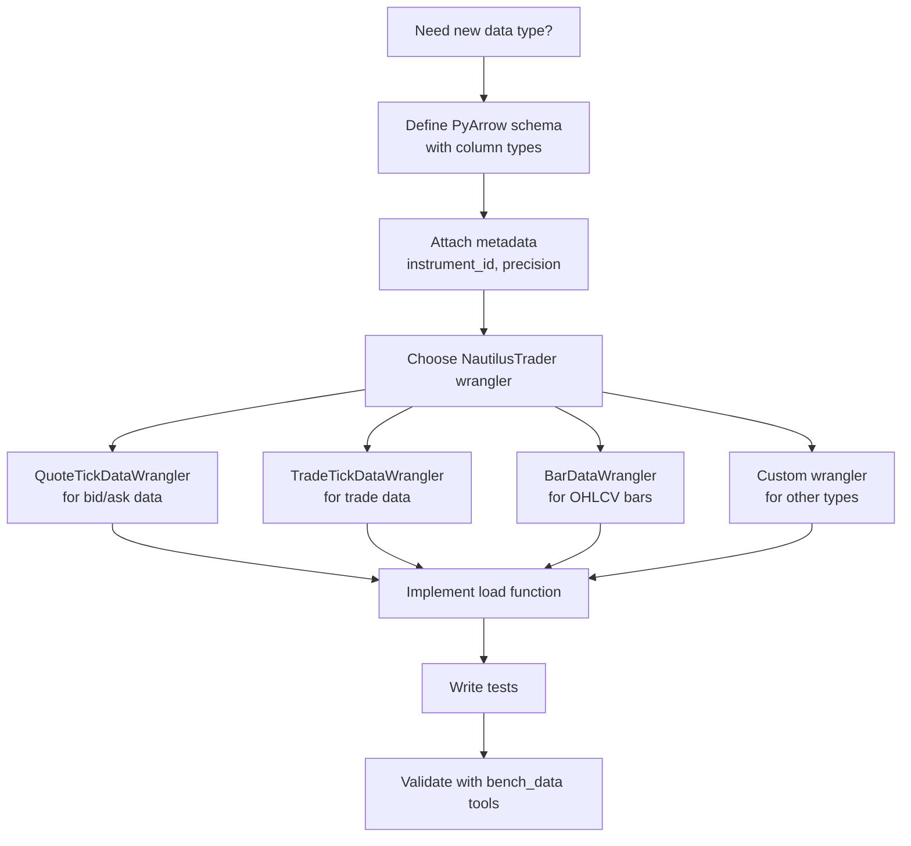

# Development Guide

This document covers development standards, design patterns, tooling, and guidance for extending `nautilus_data` with new data providers, instruments, and benchmark datasets.

## Development Environment Setup

### Prerequisites

- Python 3.13+
- [uv](https://docs.astral.sh/uv/) package manager
- NautilusTrader >= 1.220.0 (installed from the Nautech private index)

### Installation

```bash
# Clone and install
cd nautilus_data
make install-dev    # Installs all dev dependencies

# Or manually
uv sync --all-groups
```

### Verify Installation

```bash
uv run python -c "import nautilus_data; print('OK')"
uv run python -c "from nautilus_data.hist_data_to_catalog import load_fx_hist_data; print('OK')"
```

## Project Layout



### Source Layout Convention

The project uses the `src/` layout pattern (`src/nautilus_data/`), which:
- Prevents accidental imports of the development version
- Forces proper installation before testing
- Is configured in `pyproject.toml` via `[tool.hatch.build.targets.wheel]`

## Code Quality Standards

### Linting with Ruff

Ruff is configured in `pyproject.toml` with an extensive rule set:

```bash
make ruff      # Lint with auto-fix
make format    # Format code
```

Key enabled rule categories:
- **E/W/F**: pycodestyle errors, warnings, pyflakes
- **D**: pydocstyle (docstring conventions)
- **UP**: pyupgrade (Python version upgrades)
- **S**: bandit (security)
- **SIM**: simplification suggestions
- **B**: bugbear (common bugs)
- **PERF**: performance anti-patterns
- **TC**: type checking imports
- **PTH**: pathlib preference over os.path

### Type Checking

```bash
make mypy      # Run mypy static type checker
```

Configuration in `pyproject.toml`:
- Target: Python 3.13
- `warn_no_return = true`
- `warn_unused_configs = true`
- `ignore_missing_imports = true` (needed for NautilusTrader Cython modules)

### Testing

```bash
make pytest    # Run test suite
```

Pytest is configured with strict settings:
- `--strict-markers`: Unknown markers cause errors
- `--import-mode=importlib`: Modern import mode for src layout
- `xfail_strict = true`: `xfail` tests that pass will fail
- `filterwarnings = ["error"]`: All warnings become errors

## Design Patterns

### Pipeline Pattern

The core data flow follows the **Pipeline pattern** where data is transformed through a series of stages. Each stage has a single responsibility:

```mermaid
flowchart LR
    subgraph Stage1["Stage 1: Acquire"]
        DL["download()"]
    end

    subgraph Stage2["Stage 2: Parse"]
        LOAD["CSVTickDataLoader.load()"]
        RENAME["Column rename"]
    end

    subgraph Stage3["Stage 3: Transform"]
        WRANGLE["QuoteTickDataWrangler.process()"]
    end

    subgraph Stage4["Stage 4: Persist"]
        CATALOG["ParquetDataCatalog.write_data()"]
    end

    Stage1 -->|file path| Stage2 -->|DataFrame| Stage3 -->|List[QuoteTick]| Stage4
```

### Composition over Inheritance

The library composes NautilusTrader components rather than inheriting from them:
- `CSVTickDataLoader` is used as a utility, not subclassed
- `QuoteTickDataWrangler` is instantiated with an instrument, not extended
- `ParquetDataCatalog` is used as a storage backend, not wrapped

### Convention over Configuration

File naming and path conventions are used instead of configuration files:
- Benchmark files follow `{type}_{instrument}_{date}.parquet` naming
- Schema selection is based on filename: `"quotes" in input_file` (see `bench_data/extract_groups.py`)
- Catalog directory is derived from module location: `Path(__file__).parent.parent / "catalog"`

## Adding a Custom Data Provider

### Step 1: Understand the Interface

A data provider in `nautilus_data` needs to produce a pandas DataFrame with columns that match what a NautilusTrader wrangler expects.

For quote ticks, the wrangler expects:
```
Index: DatetimeIndex (timestamps)
Columns: bid_price, ask_price, size
```

For trade ticks, the wrangler expects:
```
Index: DatetimeIndex (timestamps)
Columns: price, size, aggressor_side, trade_id
```

### Step 2: Create a New Loading Function

Add a new function to `src/nautilus_data/hist_data_to_catalog.py` or create a new module:

```python
# Example: Adding Binance crypto data support
from pathlib import Path

from nautilus_trader.persistence.catalog import ParquetDataCatalog
from nautilus_trader.persistence.wranglers import TradeTickDataWrangler
from nautilus_trader.test_kit.providers import TestInstrumentProvider


def load_crypto_trade_data(
    filename: str,
    symbol: str,
    catalog_path: str | Path,
) -> None:
    """
    Load crypto trade data into a NautilusTrader catalog.

    Parameters
    ----------
    filename : str
        Path to the CSV file containing trade data.
    symbol : str
        Trading pair symbol (e.g., "BTC/USDT").
    catalog_path : str | Path
        Directory for the Parquet catalog output.

    """
    # 1. Resolve instrument
    instrument = TestInstrumentProvider.btcusdt_binance()

    # 2. Create wrangler
    wrangler = TradeTickDataWrangler(instrument)

    # 3. Load and prepare data
    import pandas as pd

    df = pd.read_csv(
        filename,
        index_col="timestamp",
        parse_dates=True,
    )
    # Rename columns to match wrangler expectations
    df.columns = ["price", "size", "aggressor_side", "trade_id"]

    # 4. Wrangle
    ticks = wrangler.process(df)

    # 5. Write to catalog
    catalog = ParquetDataCatalog(catalog_path)
    catalog.write_data([instrument])
    catalog.write_data(ticks)
```

### Step 3: Add Download Support (Optional)

If the data comes from a remote source, add a download function:

```python
def download_crypto_data(url: str, output_dir: Path) -> Path:
    """Download crypto data and return the local file path."""
    import requests

    filename = url.rsplit("/", maxsplit=1)[1]
    output_path = output_dir / filename

    with open(output_path, "wb") as f:
        f.write(requests.get(url).content)

    return output_path
```

### Step 4: Register in main() or Create a New Entry Point

```python
def main():
    # Existing FX data
    download("https://raw.githubusercontent.com/.../DAT_ASCII_EURUSD_T_202001.csv.gz")
    load_fx_hist_data(
        filename="DAT_ASCII_EURUSD_T_202001.csv.gz",
        currency="EUR/USD",
        catalog_path=CATALOG_DIR,
    )

    # New crypto data
    download_crypto_data(
        url="https://example.com/btcusdt_trades_202301.csv",
        output_dir=Path("raw_data/crypto"),
    )
    load_crypto_trade_data(
        filename="raw_data/crypto/btcusdt_trades_202301.csv",
        symbol="BTC/USDT",
        catalog_path=CATALOG_DIR,
    )
```

## Adding Benchmark Data

### Step 1: Prepare the Data

Use `extract_groups.py` to partition your Parquet files into uniform row groups:

```bash
python bench_data/extract_groups.py \
    source_data.parquet \
    bench_data/multi_stream_data/quotes_XXXX_20230101.parquet \
    5000
```

### Step 2: Validate Integrity

Extract timestamp boundaries and check invariants:

```bash
# Extract boundaries
python bench_data/extract_ts_init.py \
    bench_data/multi_stream_data/quotes_XXXX_20230101.parquet \
    /tmp/boundaries.csv

# Validate
python bench_data/check_invariant.py /tmp/boundaries.csv
```

### Step 3: Update Statistics

Regenerate the stats file:

```bash
python bench_data/gen_data_stats.py bench_data/ bench_data/stats.csv
```

## Schema Extension



### Schema Best Practices

1. **Use fixed-point integers for prices** - Avoid floating-point rounding
2. **Use `uint64` for timestamps** - Nanosecond precision, matches NautilusTrader
3. **Attach metadata at schema level** - `instrument_id`, `price_precision`, `size_precision`
4. **Use Snappy compression** - Best throughput-to-ratio for tick data

## Makefile Targets Reference

| Target | Description |
|--------|-------------|
| `make install` | Install dependencies with uv |
| `make install-dev` | Install all dev dependencies |
| `make update` | Update dependencies |
| `make clean` | Clean caches and build artifacts |
| `make clean-caches` | Clean pytest, mypy, ruff caches |
| `make distclean` | Nuclear clean (requires `FORCE=1`) |
| `make format` | Format code with ruff |
| `make ruff` | Lint with ruff + auto-fix |
| `make mypy` | Static type checking |
| `make pytest` | Run tests |
| `make pre-commit` | Run all pre-commit hooks |
| `make docker-build` | Build Docker image |
| `make docker-build-force` | Rebuild without cache |
| `make docker-push` | Push to GHCR |

## Docker Development

### Building

```bash
make docker-build              # Standard build
make docker-build-force        # No-cache rebuild
```

### Image Details

- **Registry**: `ghcr.io/nautechsystems/nautilus_data`
- **Tag**: Current git branch name
- **Base**: `python:3.13-slim`
- **Catalog**: Pre-generated at `/opt/pysetup/catalog/`

### Testing the Image

```bash
docker run --rm -it ghcr.io/nautechsystems/nautilus_data:main \
    python -c "from nautilus_trader.persistence.catalog import ParquetDataCatalog; \
               c = ParquetDataCatalog('/opt/pysetup/catalog'); \
               print(c.instruments())"
```

## Common Development Tasks

### Regenerate the Catalog

```bash
uv run python -m nautilus_data.hist_data_to_catalog
```

### Inspect a Parquet File

```python
import pyarrow.parquet as pq

pf = pq.ParquetFile("bench_data/quotes_0005.parquet")
print(f"Row groups: {pf.num_row_groups}")
print(f"Schema: {pf.schema_arrow}")
print(f"Metadata: {pf.schema_arrow.metadata}")

# Read first row group
table = pf.read_row_group(0)
print(f"Rows: {table.num_rows}")
print(table.to_pandas().head())
```

### Add a New FX Currency Pair

```python
from nautilus_data.hist_data_to_catalog import load_fx_hist_data

# Assuming you have the raw data file
load_fx_hist_data(
    filename="raw_data/fx_hist_data/DAT_ASCII_GBPUSD_T_202001.csv.gz",
    currency="GBP/USD",
    catalog_path="src/catalog",
)
```

## Upstream Sync

When syncing from the upstream repository, follow the checklist in [MIGRATION_GUIDE.md](MIGRATION_GUIDE.md). Key points:

1. Upstream may modify `[project]` metadata -- merge those changes
2. Keep `[tool.ruff]`, `[tool.pyright]`, `[tool.pytest]` sections intact
3. If upstream adds files to old `nautilus_data/` path, move to `src/nautilus_data/`
4. Run `uv lock` after dependency changes
5. Verify: `uv sync && uv run python -c "import nautilus_data" && uv run pytest`

## Configuration Reference

`nautilus_data` uses minimal configuration, relying on conventions and NautilusTrader defaults. The following parameters control behavior in `hist_data_to_catalog.py` and the benchmark utilities.

| Parameter | Type | Default | Description |
|-----------|------|---------|-------------|
| `filename` | `str` | (required) | Path to the source CSV or gzip-compressed CSV file |
| `currency` | `str` | (required) | FX pair in `"BASE/QUOTE"` format, e.g. `"EUR/USD"`. Must match a `TestInstrumentProvider` instrument |
| `catalog_path` | `str \| Path` | `ROOT / "catalog"` | Directory for Parquet catalog output. Created automatically if missing |
| `index_col` | `int` | `0` | Column index used as the DataFrame datetime index in `CSVTickDataLoader.load()` |
| `datetime_format` | `str` | `"%Y%m%d %H%M%S%f"` | strptime format for parsing timestamps from the CSV |

**Benchmark utility parameters** (command-line positional args):

| Script | Arg 1 | Arg 2 | Arg 3 | Description |
|--------|-------|-------|-------|-------------|
| `extract_groups.py` | `input_file` | `output_file` | `row_group_size` | Partition a Parquet file into uniform row groups |
| `extract_ts_init.py` | `input_file` | `output_csv` | -- | Extract `ts_init` boundaries per row group to CSV |
| `check_invariant.py` | `boundaries_csv` | -- | -- | Validate monotonic ordering of `ts_init` |
| `gen_data_stats.py` | `data_dir` | `output_csv` | -- | Generate file-level statistics (size, rows, max row group) |

**pyproject.toml key settings:**

| Setting | Value | Description |
|---------|-------|-------------|
| `requires-python` | `>=3.13` | Minimum Python version |
| `nautilus_trader` | `>=1.220.0` | Minimum NautilusTrader version |
| `[tool.uv.sources]` | `nautechsystems` index | Private PyPI index at `packages.nautechsystems.io/simple` |
| `[tool.ruff] target-version` | `"py313"` | Ruff linting target |
| `[tool.mypy] python_version` | `"3.13"` | Mypy target version |

## Troubleshooting

### 1. `ModuleNotFoundError: No module named 'nautilus_trader'`

NautilusTrader is hosted on a private index. Install via uv with the configured index:
```bash
uv sync --all-groups
```
Or with pip, specifying the extra index:
```bash
pip install nautilus_trader --extra-index-url https://packages.nautechsystems.io/simple
```

### 2. Import works but `CSVTickDataLoader` or `QuoteTickDataWrangler` not found

These classes live in `nautilus_trader.test_kit.providers` and `nautilus_trader.persistence.wranglers` respectively. Ensure your NautilusTrader version is `>= 1.220.0`. Older versions used different module paths.

### 3. `FileNotFoundError` when running `hist_data_to_catalog.py`

The `main()` function downloads the CSV to the **current working directory**, not the `raw_data/` folder. Either `cd` to the project root before running, or call `load_fx_hist_data()` directly with an absolute path.

### 4. Parquet catalog is empty after writing

`ParquetDataCatalog.write_data()` requires a list of data objects, not a single object. Ensure you pass `[instrument]` (list) for instruments and `ticks` (already a list from `wrangler.process()`).

### 5. `check_invariant.py` reports timestamp ordering violations

This indicates that `ts_init` values are not monotonically increasing across row group boundaries. This can happen if data from multiple instruments or non-sequential time ranges was merged into a single file. Re-extract row groups from properly sorted source data.

### 6. Docker build fails with pip resolver errors

The Dockerfile installs from the Nautech private index. Ensure your build environment has network access to `packages.nautechsystems.io`. If behind a corporate proxy, pass `--build-arg` for proxy settings.

### 7. `make distclean` refuses to run

This is a safety measure. Pass `FORCE=1`:
```bash
make distclean FORCE=1
```

## Security Considerations

- **Private package index**: NautilusTrader is installed from `packages.nautechsystems.io/simple`. Ensure this URL is accessed over HTTPS and is not redirected. Pin exact versions in `uv.lock` to prevent supply-chain attacks.
- **No credentials in source**: The library does not require API keys or authentication tokens. Data is downloaded from public GitHub raw URLs.
- **Docker image**: The Docker image at `ghcr.io/nautechsystems/nautilus_data` includes pre-generated catalog data. Do not embed private data or credentials in custom images. Use multi-stage builds if adding proprietary data sources.
- **Parquet file integrity**: When consuming Parquet files from untrusted sources, validate with `check_invariant.py` and `gen_data_stats.py` before loading into production catalogs. Malformed Parquet metadata could cause unexpected behavior.
- **Dependency surface**: The production dependencies are minimal (`nautilus_trader`, `requests`). Dev dependencies include `ruff`, `mypy`, `pytest`, and `pre-commit`. Review lock files after updates to ensure no unexpected transitive dependencies.
- **File permissions**: Catalog directories contain market data that may have licensing restrictions. Set appropriate filesystem permissions and do not serve catalog directories over public HTTP endpoints.

---
## See Also
- [README](README.md) — Project overview and quick start
- [Architecture](architecture.md) — System design and components
- [Workflow](workflow.md) — Event flows and processing pipelines
- [State Management](state-management.md) — State lifecycle and data models
