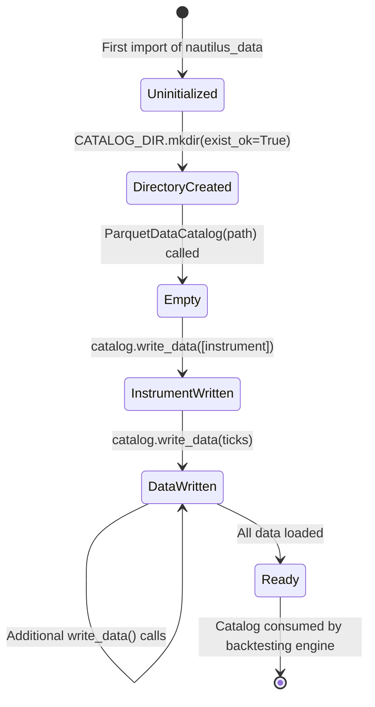
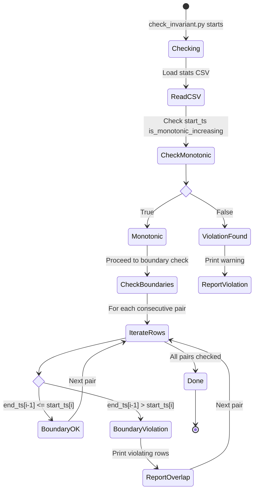
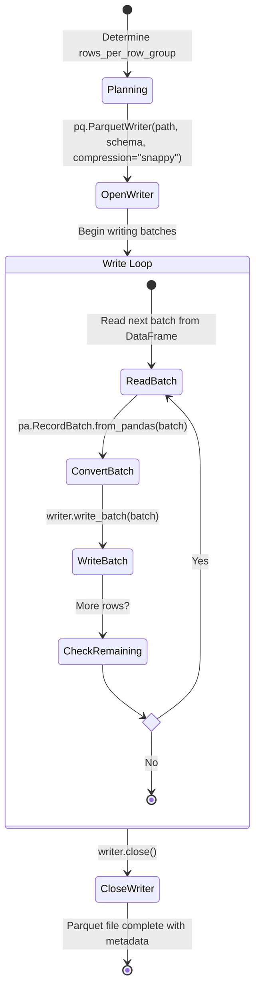

# State Management

This document describes how `nautilus_data` manages data state across the catalog lifecycle, including catalog initialization, data integrity invariants, row group state, and the relationship between raw data, transformed data, and catalog state.

## Catalog State Model

The `ParquetDataCatalog` is the central stateful component. It manages a directory of Parquet files that represent the complete state of all ingested market data. The catalog has a simple lifecycle: create, write, and read.



### Catalog Directory State

The catalog directory is created eagerly on module import:

```python
# src/nautilus_data/hist_data_to_catalog.py, lines 26-28
ROOT = Path(__file__).parent.parent
CATALOG_DIR = ROOT / "catalog"
CATALOG_DIR.mkdir(exist_ok=True)
```

This means importing `nautilus_data.hist_data_to_catalog` has the side effect of creating the `src/catalog/` directory if it does not exist. The `exist_ok=True` flag makes this operation idempotent.

### Write Ordering

The catalog requires a specific write order:
1. **Instrument definitions first** - The catalog needs instrument metadata before tick data
2. **Tick data second** - References the previously written instrument

This ordering is enforced by the `load_fx_hist_data()` function which always calls `catalog.write_data([instrument])` before `catalog.write_data(ticks)`.

## Data Integrity State

The benchmark utilities define and enforce two key data integrity invariants on Parquet files.

### Invariant 1: Monotonic Timestamp Ordering

Within a Parquet file, the `ts_init` (initialization timestamp) values across row groups must be monotonically increasing. This means:

```
Row Group 0: start_ts[0] < start_ts[1] < start_ts[2] < ...
```



### Invariant 2: Non-Overlapping Row Group Boundaries

For consecutive row groups `i` and `i+1`, the end timestamp of group `i` must not exceed the start timestamp of group `i+1`:

```
end_ts[i] <= start_ts[i+1]   for all i in [0, N-1)
```

This ensures that time-range queries can safely skip row groups based on their boundary timestamps without missing any data.

### Validation Workflow State

The validation process has its own state machine driven by the `check_invariant.py` script:

```python
# bench_data/check_invariant.py
def check_file(file_name):
    df = pd.read_csv(file_name)
    # Invariant 1: Monotonic start_ts
    if not df["start_ts"].is_monotonic_increasing:
        print("The 'start_ts' column is not in ascending order.")
    # Invariant 2: Non-overlapping boundaries
    for i in range(1, len(df)):
        if df.loc[i - 1, "end_ts"] > df.loc[i, "start_ts"]:
            print(f"Row {i - 1} and {i} fail the check:")
```

## Row Group State

Row groups are the fundamental unit of state within a Parquet file. Each row group maintains its own metadata and column statistics.



### Row Group Metadata

Each row group carries implicit state through its column statistics (min/max values), which enables predicate pushdown during reads. The `extract_ts_init.py` utility makes this state explicit by extracting the boundary timestamps:

```python
# bench_data/extract_ts_init.py
for i in range(parquet_file.num_row_groups):
    table = parquet_file.read_row_group(i)
    ts_init_values = table.column("ts_init").to_pandas().tolist()
    writer.writerow([i, ts_init_values[0], ts_init_values[-1], table.num_rows])
```

The extracted state per row group:
- `index`: Sequential row group number
- `start_ts`: First `ts_init` value in the group
- `end_ts`: Last `ts_init` value in the group
- `group_size`: Number of rows in the group

## Schema State

Schemas carry metadata that defines how to interpret the raw column values. This metadata is statically defined and attached at the schema level.

### Quote Tick Schema State

```python
# bench_data/extract_groups.py
quote_tick_schema = pa.schema([
    ("bid", pa.int64()),
    ("ask", pa.int64()),
    ("bid_size", pa.uint64()),
    ("ask_size", pa.uint64()),
    ("ts_event", pa.uint64()),
    ("ts_init", pa.uint64()),
]).with_metadata({
    "instrument_id": "EUR/USD.SIM",
    "price_precision": "0",
    "size_precision": "0",
})
```

### Trade Tick Schema State

```python
trade_tick_schema = pa.schema([
    ("price", pa.int64()),
    ("size", pa.uint64()),
    ("aggresor_side", pa.uint8()),
    ("trade_id", pa.string()),
    ("ts_event", pa.uint64()),
    ("ts_init", pa.uint64()),
]).with_metadata({
    "instrument_id": "EUR/USD.SIM",
    "price_precision": "0",
    "size_precision": "0",
})
```

The schema metadata is essential state because it determines how to decode fixed-point integers back into decimal prices. Without `price_precision`, a bid value of `112345` is ambiguous (1.12345? 11.2345? 112.345?).

## Multi-Stream Data State

The benchmark dataset in `bench_data/multi_stream_data/` represents a complex multi-instrument state across time.

```mermaid
stateDiagram-v2
    state "Instrument 0005" as I0005 {
        [*] --> Q0005_D1: quotes_0005_20221101
        Q0005_D1 --> Q0005_D2: quotes_0005_20221102
        Q0005_D2 --> Q0005_D3: quotes_0005_20221103
        Q0005_D3 --> Q0005_D4: quotes_0005_20221104
        Q0005_D4 --> Q0005_D5: quotes_0005_20221108
        Q0005_D5 --> Q0005_D6: quotes_0005_20221109
    }

    state "Instrument 9626" as I9626 {
        [*] --> Q9626_D1: quotes_9626_20221101
        Q9626_D1 --> Q9626_D2: quotes_9626_20221102
        Q9626_D2 --> Q9626_D3: ...through 20221109
    }

    state "Instrument 9868" as I9868 {
        [*] --> Q9868_D1: quotes_9868_20221101
        Q9868_D1 --> Q9868_D2: ...through 20221109
    }

    note right of I0005 : Each instrument also has<br/>matching trades_*_*.parquet files
    note right of I9626 : 5 instruments total:<br/>0005, 9626, 9868, 9961, 9999
```

### Data Volume

From `bench_data/stats.csv`, the dataset contains:
- **Total files**: 60 Parquet files (5 instruments x 6 days x 2 types)
- **Row group size**: 5,000 rows per group
- **Primary benchmark file**: `quotes_0005.parquet` - 9,689,614 rows, ~139 MB

### File Naming Convention

The naming pattern encodes instrument and date state:
```
{type}_{instrument_id}_{date}.parquet
```
- `type`: `quotes` or `trades`
- `instrument_id`: 4-digit numeric ID
- `date`: `YYYYMMDD` format

## Pipeline State Transitions

The complete state of the data pipeline can be described as a progression through transformation stages:

| Stage | State | Location | Format |
|-------|-------|----------|--------|
| Raw | Compressed CSV | `raw_data/fx_hist_data/*.csv.gz` | Gzip CSV |
| Downloaded | Local CSV file | Working directory | Gzip CSV |
| Loaded | DataFrame | Memory | pandas DataFrame |
| Renamed | DataFrame with standard columns | Memory | pandas DataFrame |
| Wrangled | List of typed tick objects | Memory | `List[QuoteTick]` |
| Cataloged | Persisted Parquet with metadata | `catalog/` | Apache Parquet |
| Validated | Integrity-checked Parquet | `bench_data/` | Apache Parquet + CSV stats |

Each transition is irreversible in the pipeline flow -- the system does not support reverse transformations (e.g., Parquet back to raw CSV).

## Error States

The pipeline can enter error states at several points:

- **Network failure**: `download()` will raise a `requests` exception if the GitHub URL is unreachable
- **File not found**: `CSVTickDataLoader.load()` raises `FileNotFoundError` for missing data files
- **Schema mismatch**: Wrangling will fail if the DataFrame columns do not match expected names after renaming
- **Disk full**: `ParquetDataCatalog.write_data()` may fail with `IOError` if the catalog directory is on a full filesystem
- **Invalid instrument**: `TestInstrumentProvider.default_fx_ccy()` will fail for unsupported currency pairs

None of these error states are explicitly handled in the current codebase -- exceptions propagate to the caller.

---
## See Also
- [README](README.md) — Project overview and quick start
- [Architecture](architecture.md) — System design and components
- [Workflow](workflow.md) — Event flows and processing pipelines
- [Development](development.md) — Development guide and best practices
