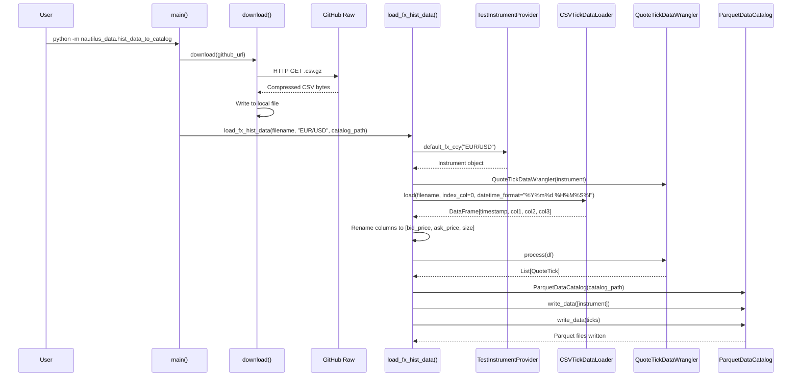
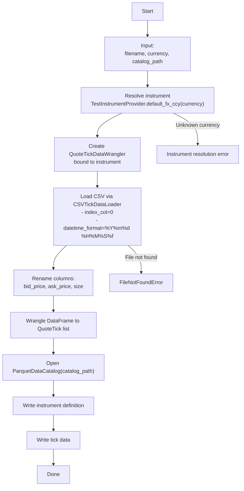
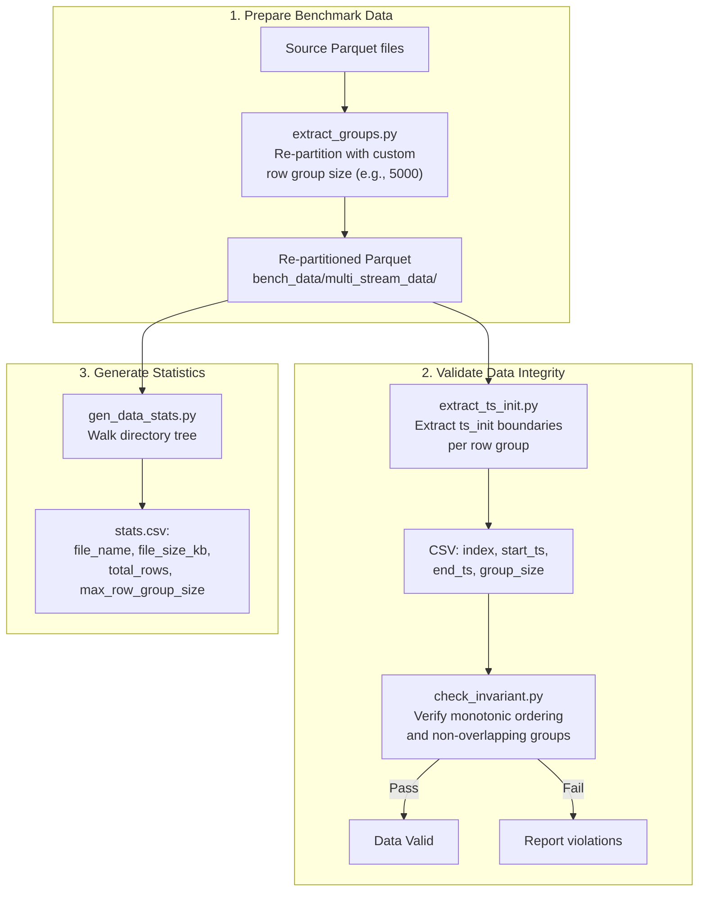
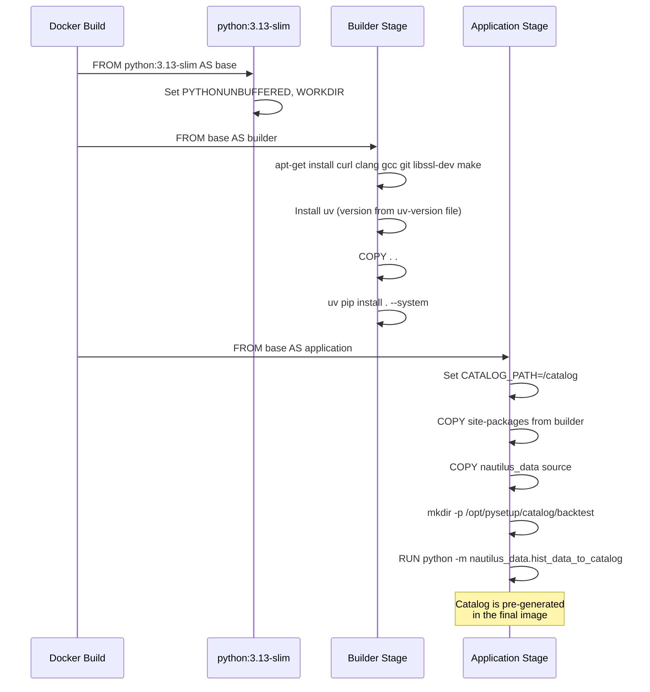
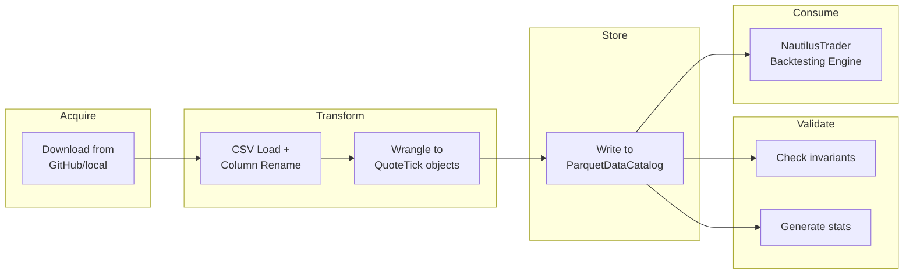

# Workflows

This document describes the major data workflows in `nautilus_data`, from raw data acquisition through catalog generation and benchmarking.

## Data Ingestion Flow

The primary workflow downloads raw FX tick data and transforms it into a NautilusTrader-compatible Parquet catalog. This is orchestrated by the `main()` function in `src/nautilus_data/hist_data_to_catalog.py`.



### Step-by-Step

1. **Download**: `download()` fetches the gzip-compressed CSV from GitHub's raw content URL. The file is written to the current working directory with the filename extracted from the URL.

2. **Instrument Resolution**: `TestInstrumentProvider.default_fx_ccy("EUR/USD")` creates a fully specified FX instrument with venue, price precision, size precision, and other trading parameters.

3. **CSV Loading**: `CSVTickDataLoader.load()` reads the compressed CSV with:
   - Column 0 as the index (timestamps)
   - Datetime format: `%Y%m%d %H%M%S%f` (e.g., `20200102 170000123456`)

4. **Column Mapping**: The raw DataFrame columns are renamed to `["bid_price", "ask_price", "size"]` to match the wrangler's expected input format.

5. **Wrangling**: `QuoteTickDataWrangler.process()` converts each row into a `QuoteTick` object with proper fixed-point price encoding and nanosecond timestamps.

6. **Catalog Write**: Both the instrument definition and tick data are written separately to the `ParquetDataCatalog`.

## Custom Data Loading Flow

For loading data from local files or different currency pairs, the `load_fx_hist_data()` function accepts custom parameters.



### Usage Example

```python
from nautilus_data.hist_data_to_catalog import load_fx_hist_data

# Load GBP/USD data from a local file
load_fx_hist_data(
    filename="/path/to/raw_data/fx_hist_data/DAT_ASCII_GBPUSD_T_202001.csv.gz",
    currency="GBP/USD",
    catalog_path="/home/user/my_catalog",
)
```

## Benchmark Data Preparation Flow

The benchmark utilities in `bench_data/` provide a workflow for preparing and validating test datasets.



### Row Group Re-Partitioning

The `extract_groups.py` script re-writes a Parquet file with a specified number of rows per row group:

```bash
python bench_data/extract_groups.py input.parquet output.parquet 5000
```

This uses a streaming write pattern:
1. Read the full DataFrame from the input file
2. Determine the appropriate schema (quote or trade) based on filename
3. Open a `ParquetWriter` with Snappy compression
4. Write batches of `rows_per_row_group` rows as individual row groups
5. Close the writer

### Timestamp Boundary Extraction

The `extract_ts_init.py` script reads each row group and records the first and last `ts_init` values:

```bash
python bench_data/extract_ts_init.py data.parquet boundaries.csv
```

Output format:
```csv
index,start_ts,end_ts,group_size
0,1667260800000000000,1667261234567890000,5000
1,1667261234567890001,1667262000000000000,5000
```

### Invariant Checking

The `check_invariant.py` script validates two properties on the boundary CSV:

1. **Monotonic `start_ts`**: All row groups have strictly increasing start timestamps
2. **Non-overlapping boundaries**: `end_ts[i] <= start_ts[i+1]` for consecutive row groups

```bash
python bench_data/check_invariant.py boundaries.csv
```

### Statistics Generation

The `gen_data_stats.py` script walks a directory tree and records per-file statistics:

```bash
python bench_data/gen_data_stats.py bench_data/ bench_data/stats.csv
```

Output includes file size, total row count, and maximum row group size for each Parquet file found.

## Docker Build Flow

The Dockerfile automates the entire data pipeline in a reproducible container build.



Key aspects of the Docker workflow:
- **Multi-stage build** keeps the final image small (no build tools)
- **Catalog pre-generation** at build time means the image is ready to use immediately
- **uv version pinning** via the `uv-version` file ensures reproducible builds

## End-to-End Backtesting Data Workflow

Combining all components, here is the full workflow from raw data to backtesting:



## File Reference

| File | Role in Workflow |
|------|-----------------|
| `src/nautilus_data/hist_data_to_catalog.py` | Core pipeline: download, load, wrangle, catalog |
| `bench_data/extract_groups.py` | Row group re-partitioning for benchmark prep |
| `bench_data/extract_ts_init.py` | Row group boundary extraction |
| `bench_data/check_invariant.py` | Timestamp ordering validation |
| `bench_data/gen_data_stats.py` | Parquet file statistics generation |
| `bench_data/stats.csv` | Pre-computed statistics for benchmark data |
| `raw_data/fx_hist_data/DAT_ASCII_EURUSD_T_202001.csv.gz` | Source EUR/USD tick data |
| `Dockerfile` | Containerized pipeline with pre-built catalog |

---
## See Also
- [README](README.md) — Project overview and quick start
- [Architecture](architecture.md) — System design and components
- [State Management](state-management.md) — State lifecycle and data models
- [Development](development.md) — Development guide and best practices
